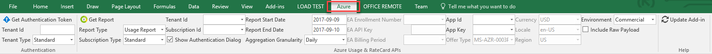
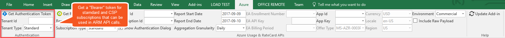
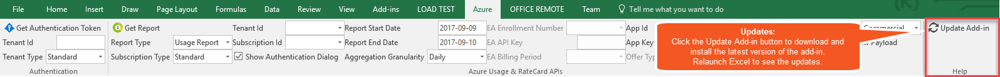
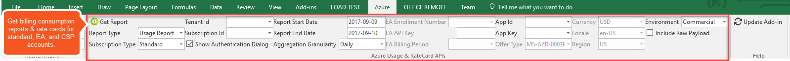
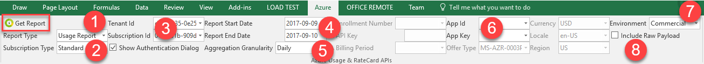
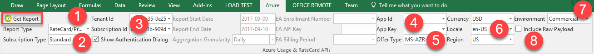
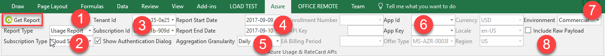
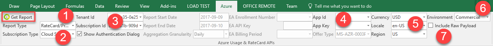
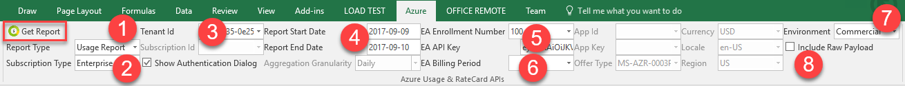
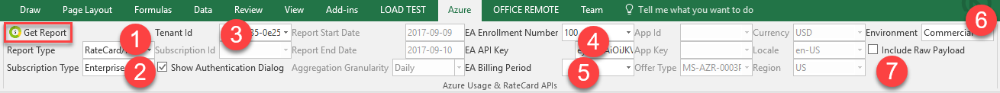

# Azure Excel Add-in
An Excel add-in for accessing Azure functions like usage aggregation reports (consumption) and rate card for standard Azure accounts, [Enterprise Agreement](https://www.microsoft.com/en-us/licensing/licensing-programs/enterprise.aspx) (EA) accounts, and [Cloud Solution Provider](https://partner.microsoft.com/en-US/cloud-solution-provider) (CSP) accounts.

The add-in can be installed from the following location (ClickOnce installer updated by a CI build):
http://billingtools.azurewebsites.net/excel/install/setup.exe

### Table of Contents

- [Add-in Installation Prerequisites](#add-in-installation-prerequisites) 
- [How to Utilize the Different Add-in Features](#how-to-utilize-the-different-add-in-features) 
  - [Full Add-in Layout](#full-add-in-layout) 
  - [Getting Authentication Tokens](#getting-authentication-tokens) 
  - [Updating the Add-in](#updating-the-add-in) 
  - [Billing Reports Feature](#billing-reports-feature) 
    - [How to Get a Standard Usage (Consumption) Report](#how-to-get-a-standard-usage-consumption-report) 
    - [How to Get a Standard RateCard](#how-to-get-a-standard-ratecard) 
    - [How to Get a CSP Usage (Consumption) Report](#how-to-get-a-csp-usage-consumption-report) 
    - [How to Get a CSP RateCard](#how-to-get-a-csp-ratecard) 
    - [How to Get an EA Usage (Consumption) Report](#how-to-get-an-ea-usage-consumption-report) 
    - [How to Get an EA Price Sheet](#how-to-get-an-ea-price-sheet) 
- [Development Prerequisites](#development-prerequisites) 
- [Reference Information](#reference-information) 

## Add-in Installation Prerequisites
* Windows 10 (might work on Windows 8.1 or Windows 7 but not tested)
* Excel 2016 (might work with Excel 2013 but not tested)

## How to Utilize the Different Add-in Features
### Full Add-in Layout
After you [install](http://billingtools.azurewebsites.net/excel/install/setup.exe) the add-in, launch Excel and click on the Azure tab to view the add-in's ribbon.

### Getting Authentication Tokens
The add-in can be used for fetching an authentication token that can be specified as part of the "Bearer" token passed to ARM API calls in the Authorization HTTP request header.

This functionality requires specifying the Tenant Id of the account and choosing between a Standard or a Cloud Solution Provider (CSP) account.

### Updating the Add-in
The add-in can be updated so that the [latest version](http://billingtools.azurewebsites.net/excel/install/setup.exe) of the ClickOnce installer is installed. The installation process takes less than a minute.

After the add-in is updated, close Excel and then relaunch it to take advantage of any new features or updates.

### Billing Reports Feature
The add-in provides functionality that allows calling the billing APIs for getting usage (consumption report) and ratecards or price sheets for standard Azure accounts as well as Enterprise Agreement (EA) and Cloud Solution Provider (CSP) accounts.

#### How to Get a Standard Usage (Consumption) Report

1. Select "Usage Report" from the Report Type dropdown.
2. Select "Standard" from the Subscription Type dropdown.
3. Specify the Tenant Id and the Subscription Id.
4. Customize the Start and End Dates for the report (date format is: yyyy-mm-dd).
5. Specify the Aggregation Granularity (Daily or Hourly).
6. Optionally specify an AAD Application Id (or Client Id) and Application Key (or secret) to use instead of interactive authentication.
7. Select the Environment (Commercial, GovCloud, China, or Germany).
8. Optionally check the "Include Raw Payload" to see the raw JSON payload that the billing APIs return.

#### How to Get a Standard RateCard

1. Select "RateCard/PriceSheet" from the Report Type dropdown.
2. Select "Standard" from the Subscription Type dropdown.
3. Specify the Tenant Id and the Subscription Id.
4. Optionally specify an AAD Application Id (or Client Id) and Application Key (or secret) to use instead of interactive authentication.
5. Select the Offer Type. The default offer type is "Pay-As-You-Go".
6. Specify the currency code, locale, and region for the RateCard.
7. Select the Environment (Commercial, GovCloud, China, or Germany).
8. Optionally check the "Include Raw Payload" to see the raw JSON payload that the billing APIs return.

#### How to Get a CSP Usage (Consumption) Report

1. Select "Usage Report" from the Report Type dropdown.
2. Select "Cloud Solution Provider" from the Subscription Type dropdown.
3. Specify the Tenant Id and the Subscription Id.
4. Customize the Start and End Dates for the report (date format is: yyyy-mm-dd).
5. Specify the Aggregation Granularity (Daily or Hourly).
6. Optionally specify an AAD Application Id (or Client Id) and Application Key (or secret) to use instead of interactive authentication.
7. Select the Environment (Commercial, GovCloud, China, or Germany).
8. Optionally check the "Include Raw Payload" to see the raw JSON payload that the billing APIs return.

#### How to Get a CSP RateCard

1. Select "RateCard/PriceSheet" from the Report Type dropdown.
2. Select "Cloud Solution Provider" from the Subscription Type dropdown.
3. Specify the Tenant Id and the Subscription Id.
4. Optionally specify an AAD Application Id (or Client Id) and Application Key (or secret) to use instead of interactive authentication.
5. Specify the currency code, locale, and region for the RateCard.
6. Select the Environment (Commercial, GovCloud, China, or Germany).
7. Optionally check the "Include Raw Payload" to see the raw JSON payload that the billing APIs return.

#### How to Get an EA Usage (Consumption) Report

1. Select "Usage Report" from the Report Type dropdown.
2. Select "Enterprise Agreement" from the Subscription Type dropdown.
3. Specify the Tenant Id.
4. Customize the Start and End Dates for the report (date format is: yyyy-mm-dd).
5. Specify the EA Enrollment Number and the EA API Key obtained from the [EA Portal](https://ea.azure.com/).
6. Optionally specify the EA Billing Period (format: yyyy-mm). The default is the latest EA period.
7. Select the Environment (Commercial, GovCloud, China, or Germany).
8. Optionally check the "Include Raw Payload" to see the raw JSON payload that the billing APIs return.

#### How to Get an EA Price Sheet

1. Select "RateCard/PriceSheet" from the Report Type dropdown.
2. Select "Enterprise Agreement" from the Subscription Type dropdown.
3. Specify the Tenant Id and the Subscription Id.
4. Specify the EA Enrollment Number and the EA API Key obtained from the [EA Portal](https://ea.azure.com/).
5. Optionally specify the EA Billing Period (format: yyyy-mm). The default is the latest EA period.
6. Select the Environment (Commercial, GovCloud, China, or Germany).
7. Optionally check the "Include Raw Payload" to see the raw JSON payload that the billing APIs return.

## Development Prerequisites
* Visual Studio 2015 or 2017 
  - Download VS Community: https://www.visualstudio.com/vs/community/
* Office Developer Tools for Visual Studio installed
  - https://www.visualstudio.com/vs/office-tools/

## Reference Information
### Standard Azure Accounts
* Usage: https://msdn.microsoft.com/en-us/library/azure/mt219003.aspx
* Ratecard: https://msdn.microsoft.com/en-us/library/azure/mt219005.aspx
* Invoice Download: https://docs.microsoft.com/en-us/rest/api/billing/ 

### Enterprise Agreeement (EA)
* Usage: https://docs.microsoft.com/en-us/azure/billing/billing-enterprise-api-usage-detail
* Price Sheet: https://docs.microsoft.com/en-us/azure/billing/billing-enterprise-api-pricesheet
* Balance & Summary: https://docs.microsoft.com/en-us/azure/billing/billing-enterprise-api-balance-summary 
* Marketplace Store Charge: https://docs.microsoft.com/en-us/azure/billing/billing-enterprise-api-marketplace-storecharge
* Enabling API Access:
> In order to be able to access the EA billing APIs programmatically, you must go to the EA portal, https://ea.azure.com, and generate an API key, as described on the following page:
https://docs.microsoft.com/en-us/azure/billing/billing-enterprise-api

### Cloud Solution Provider (CSP)
* Usage: https://msdn.microsoft.com/en-us/library/partnercenter/mt791774.aspx
* Ratecard: https://msdn.microsoft.com/en-us/library/partnercenter/mt774619.aspx
* Invoice: https://msdn.microsoft.com/en-us/library/partnercenter/mt712733.aspx
* Enabling API Access:
> In order to be able to access the CSP billing APIs programmatically, you must go to the Partner Center portal and enable API access, as described on the following page: https://msdn.microsoft.com/library/partnercenter/mt709136.aspx. Please note that bullet item #2 under "*Enable API access*" on that page incorrectly states: "*From the Dashboard menu, select Account Settings, then __API__.*" Instead, it should say: "*From the Dashboard menu, select Account settings, then __App Management__.*"

